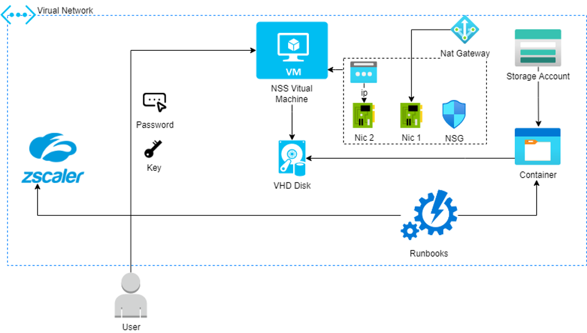

# Zscaler NSS Azure Resource Manager (ARM) Template

## Overview

This repository contains an Azure Resource Manager (ARM) template for deploying Zscaler Nanolog Streaming Service (NSS) in Azure cloud.  This ARM template will launch NSS, but at this time, you are required to modify the Network Service Groups (NSGs) to properly secure inbound connections based on your environment.

- 2 x VMNICs
  - Zscaler-NSS-MGMT-NIC - NSS Management Interface
  - Zscaler-NSS-SRVC-NIC - NSS Service Interface

- 1 x NAT Gateway (Optional)
- 2 x Public IP Addresses
  - publicIPAddress1Name - NSS Management Interface
  - publicIPAddress2Name - NAT Gateway Public IP

- 1 x VNET (Virtual Network)
- 1 x Network Security Group
- 1 x Storage Account
- 1 x Automation Account
- 1 x Virtual Machine

### NSS Architecture

## Important Notes

The template uses an Azure automation account runbook to make a copy of the new NSS OS Disk, and stores it in the newly created or existing storage account.

The NSS VM carries 2 Network Interfaces. The primary interface is used for management and carries a public IP address. At this time, you are required to modify the Network Service Groups (NSGs) to properly secure inbound connections based on your environment. The second interface is used for service purposes, and is placed on a private subnet behind a NAT Gateway.

## Initiating the Deployment

> **Note** Before you begin deployment, contact [Zscaler Support](https://help.zscaler.com/login-tickets) to obtain the NSS VHD SAS Token and the Azure VM instance type recommendations. By default this template will deploy a ``Standard_D2_v4`` VM Size; however, the following VMSizes are also supported as per [Zscaler's deployment guide documentation](https://help.zscaler.com/zia/nss-deployment-guide-microsoft-azure):

- ``Standard_D2_v4``
- ``Standard_D4_v4``
- ``Standard_D8_v4``
- ``Standard_D16_v4``

> **Note** The template takes about 20-30 minutes to deploy, mostly because the new image is around 500GB+, so be patient and don’t cancel the deployment once it is running.

## Zscaler NSS VHD Image Storage

Zscaler hosts its VHD images in multiple storage accounts across different regions. This template is configured in way, where the administrator can select which region, the VHD image must be tranferred from. We recommend that you select the storage closer to the region where the resource group and storage account will be located. The following options are available in the drop down menu when deploying the template via the Azure Template wizard:

- ``znssprod``: North America Region
- ``znssprodeu``: Europe Region
- ``znssprodau``:  Australia Region

The following options must be used specifically by Governement customers.

- ``zsgovnsstexas``: Texas
- ``zsgovnssarizona``: Arizona
- ``zsgovnssiowa``: Iowa
- ``zsgovnssvirginia``: Virginia

> **Note** Note that choosing a government region for deployment in an enterprise Azure Account is not supported and will cause the template deployment to fail.

> **Note** Each region requires authentication via dedicated SAS Token. Please contact Zscaler Support to obtain the necessary SAS token, by providing the name of the region where you want to download the VHD image from.

## Support and Reporting Issues

Support for this ARM template is made available exclusively through Github repo issue tracking.  You are also welcome to contact the contributors directly via their provided contact information.  If you find a bug, please open an issue against this repo [here](https://github.com/zscaler/nss-azure-deploy/issues).

## Contributors

Zscaler is actively contributing to and maintaining this repo.

  Contributors:
  [Eddie Parra](https://github.com/eparra), [Rohan Upalekar](https://github.com/rohan-zscaler), Anoop SV, [William Guilherme](https://github.com/willguibr)

## Licensing

This work is released under the MIT license. A copy of the license is provided in the [LICENSE](https://github.com/zscaler/nss-azure-deploy/blob/master/LICENSE) file.

## References

- [About Nanolog Streaming Service](https://help.zscaler.com/zia/about-nanolog-streaming-service)

`Tags: virtual machine, Linux, Ubuntu Server, Microsoft.Network/networkInterfaces, Microsoft.Network/networkSecurityGroups, Microsoft.Network/virtualNetworks, Microsoft.Network/virtualNetworks/subnets, Microsoft.Network/publicIPAddresses, Microsoft.Compute/virtualMachines, Microsoft.Storage/storageAccounts, Microsoft.Automation/automationAccounts`
